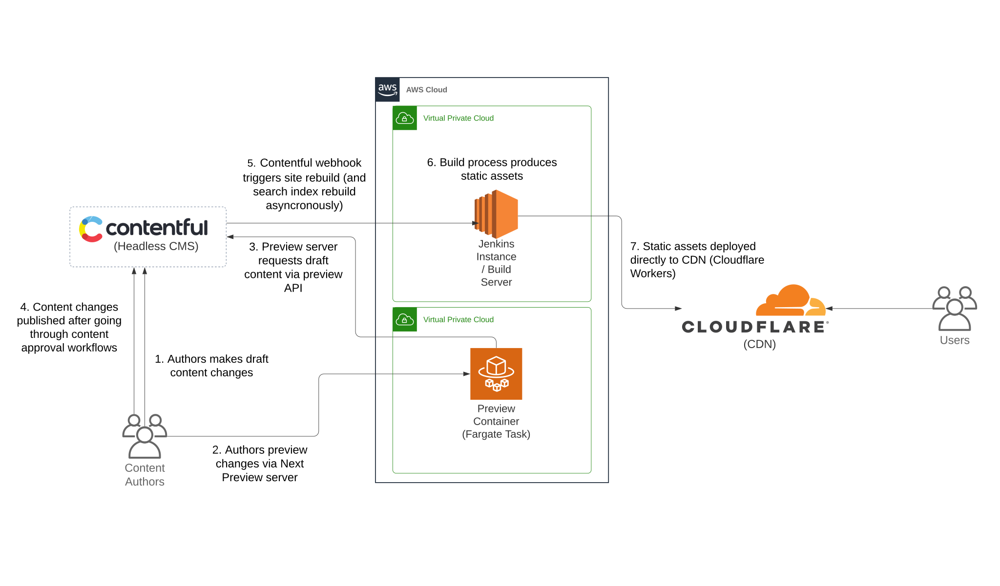
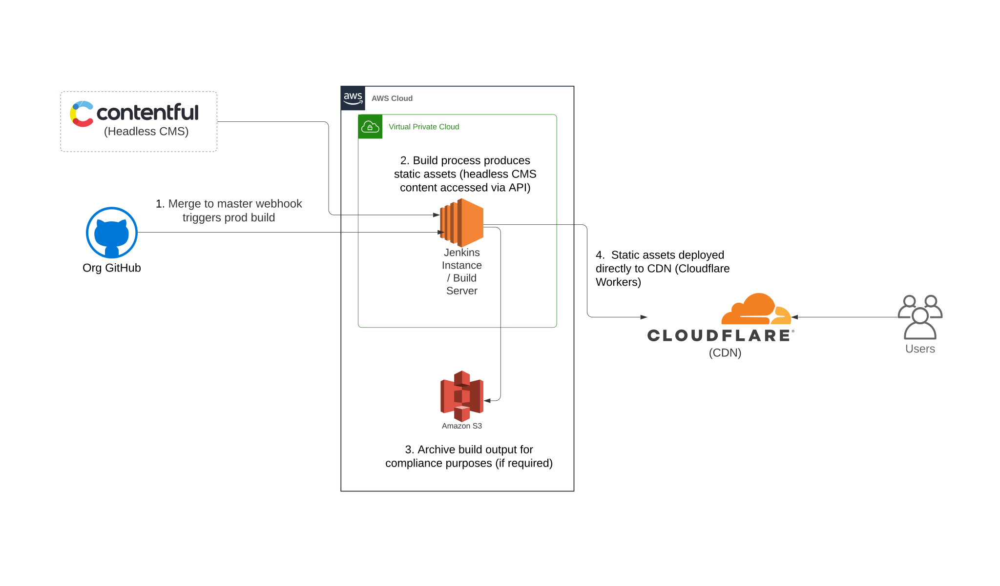

# faux.digital

Faux is a foray into the world of headless CMS-driven marketing sites, exploring what the business, developer and user experience would look like and contrasting that with a traditional CMS. The end result, along with write-ups on the architecture, processes, tech stack and benefits are available at [faux.digital](https://faux.digital).

## Overview

### Tech Stack / Principles

- Architecture: [JAMStack](https://jamstack.wtf/)
- Design methodology: [Atomic design](https://bradfrost.com/blog/post/atomic-web-design/)
- Headless CMS: [Contentful](https://www.contentful.com/)
- Static site generator: [Next.js](https://nextjs.org/)
- Hosting: [Cloudflare Workers](https://workers.cloudflare.com/)
- Preview deployments: [Vercel](https://vercel.com/)
- CI/CD: [GitHub Actions](https://github.com/features/actions)
- Search provider: [Algolia](https://www.algolia.com/)
- Frontend: Preact, TypeScript, Tailwind

### Processes / Architecture

Already covered in detail [here](https://faux.digital/blog/architecture/), but from a high-level view, this is how everything fits together.

#### Content Publishing

#### Release Process

